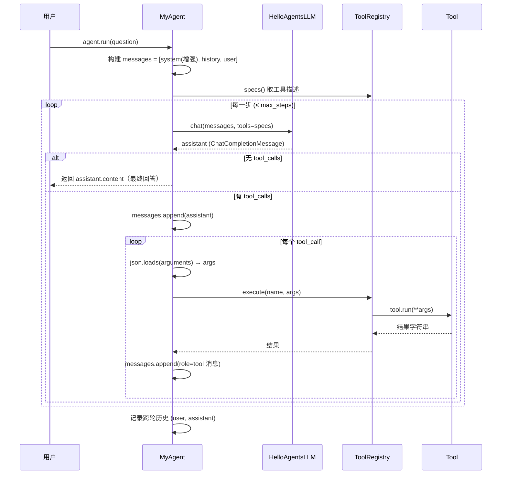
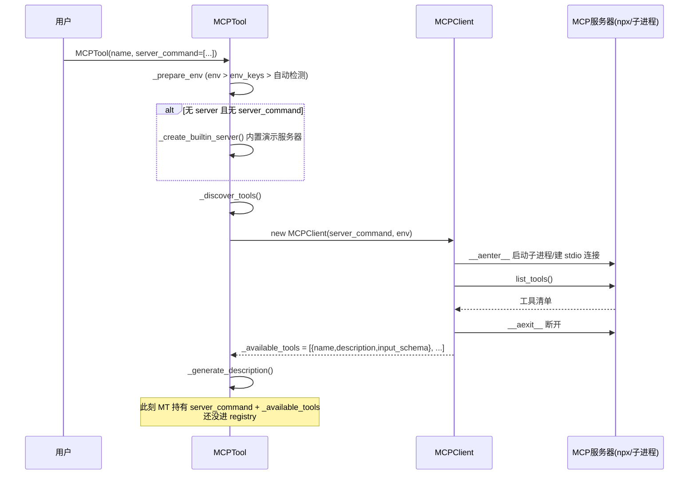
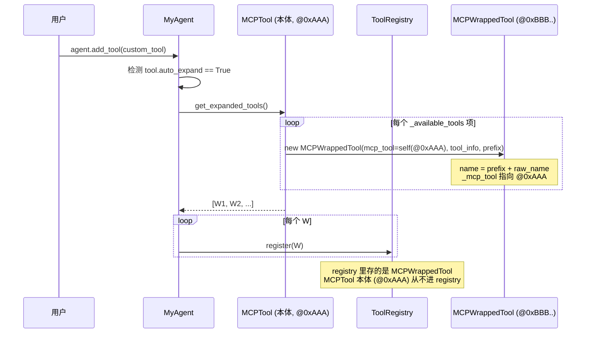
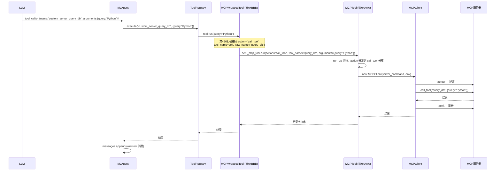
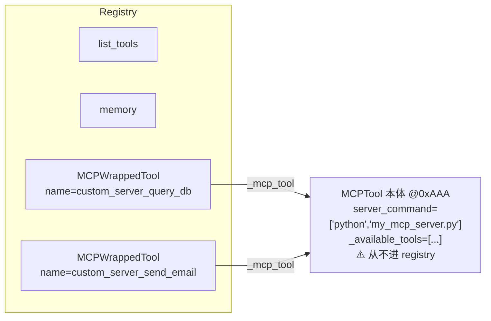

# 工具调用流程（含 MCP）

本文档梳理 `Agent.LLMClient.MyAgent` 的工具调用全流程，重点讲清 MCP 工具
（`Agent.MCP.MCPTool`）从构造、注册、展开到执行的链路。配时序图，便于下次查阅。

---

## 0. 组件速览

| 组件 | 文件 | 职责 |
|---|---|---|
| `Agent`（ABC） | `Agent/LLMClient/agent.py` | 基类：name/llm/system_prompt/history，抽象 `run` |
| `MyAgent(Agent)` | `Agent/LLMClient/my_agent.py` | function calling 循环 + 工具便利方法 + 提示词增强 |
| `HelloAgentsLLM` | `Agent/LLMClient/llm_client.py` | OpenAI 兼容客户端，`chat()` 支持原生 function calling |
| `Tool`（基类） | `Agent/LLMClient/tool.py` | 通用契约：`name/description/parameters/run/spec` |
| `ToolRegistry` | `Agent/LLMClient/tool.py` | 注册/查询/执行，产出 OpenAI tools 规格列表 |
| `MCPTool(Tool)` | `Agent/MCP/mcp_tool.py` | 连 MCP 服务器、发现工具、auto_expand、action 分发 |
| `MCPWrappedTool(Tool)` | `Agent/MCP/mcp_tool.py` | 把单个 MCP 子工具包成独立 Tool（auto_expand 用） |
| `MCPClient` | `Agent/MCP/client.py` | 异步 MCP 客户端，封装 fastmcp.Client |

---

## 1. 两种工具调用机制对比

| 维度 | 原生 Function Calling（本项目） | 文本协议（chapter7 SimpleAgent） |
|---|---|---|
| 工具告知方式 | API 的 `tools` 参数（JSON Schema） | 写进 system prompt |
| 调用返回 | 结构化 `assistant.tool_calls` 对象 | 普通文本，夹 `[TOOL_CALL:name:params]` |
| 参数形态 | 合法 JSON，`json.loads` 即得 | `a=1,b=2` 字符串，需正则+类型推断 |
| 解析方 | API 服务端已拆好字段 | 自己正则 + 模糊推断 |
| 结果回填 | `role=tool` 专用消息 | `role=user` 拼字符串 |
| 厂商依赖 | 需 API 支持 function calling | 任何 LLM 都行 |
| 可靠性 | 高 | 低 |

**本项目选原生 function calling**：`MyAgent.run` 调 `llm.chat(messages, tools=specs)`，
拿到的 `assistant` 是 `ChatCompletionMessage` 对象，直接点 `.tool_calls`、
`.function.name`、`.function.arguments`，无需解析文本。

---

## 2. MyAgent 工具调用主循环（时序图）



**关键点**：
- `registry.execute(name, args)`（`tool.py:149`）调的是 `tool.run(**args)`——
  能进 registry 的工具必为 `Tool` 子类，基类强制实现 `run`（`tool.py:24`）。
- 工具结果以 `role=tool` 消息回填，LLM 据此继续思考或给最终答案。
- 跨轮历史默认开启：本轮 user 输入与最终回答追加进 `_history`，下一轮带入；
  中间 tool 消息不持久化（与 chapter7 行为一致）。

---

## 3. MCP 工具的三段生命周期

### 3.1 构造：连服务器、抓工具清单



**注意**：构造时就会真实连一次服务器（为发现工具）。`server_command` 烙进
`MCPTool` 对象，后续所有调用都靠这个对象引用回到它。

### 3.2 注册：auto_expand 展开



**绑定靠对象引用，不是名字查找**：每个 `MCPWrappedTool` 都把 `MCPTool` 本体
（`@0xAAA`）存进 `self._mcp_tool`。这就是后续 execute 时能“找到正确
server_command”的根——顺引用回到那个烙了 server_command 的对象。

### 3.3 执行：wrapped.run → MCPTool.run → client.call_tool



**action 由谁填**：auto_expand=True 时，`MCPWrappedTool.run`（`mcp_tool.py:420`）
**硬编码** `action="call_tool"` + `tool_name=self._raw_name`，LLM 只传子工具本身的
参数，**全程不碰 action**。LLM 看到的 `parameters` 是服务器的 `input_schema`，里面
只有该子工具的字段，没有 action。

---

## 4. auto_expand 两种模式对比

| 维度 | auto_expand=True（默认） | auto_expand=False |
|---|---|---|
| registry 里存的是 | 一堆 `MCPWrappedTool` | `MCPTool` 本体（一个统一工具） |
| LLM 看到的工具名 | `custom_server_query_db` 等，每个子工具独立 | 一个 `custom_server` 统一工具 |
| LLM 看到的 parameters | 子工具原始 `input_schema` | 含 `action`/`tool_name`/`arguments` 的统一 schema |
| action 由谁填 | `MCPWrappedTool.run` 硬编码 `call_tool` | **LLM 自己在 arguments 里填 action** |
| LLM 调用形态 | `query_db(query="Python")` | `{action:"call_tool", tool_name:"query_db", arguments:{...}}` |
| 构造时连服务器 | 是（为发现工具生成展开列表） | 可选（仅用于生成描述） |

---

## 5. 对象身份与绑定关系



**为什么 LLM 选名后能找到正确的 server_command？**

LLM 只负责从一堆工具名里选一个，选中的名字通过 registry 映射到那个
`MCPWrappedTool` 对象；该对象通过 `_mcp_tool` 引用回到 `MCPTool` 本体；
本体的 `server_command` 在构造时已烙死。全程靠对象引用传递，LLM 不需要知道
server_command。

**多服务器时必须起不同 name**：auto_expand 的前缀是 `{name}_`，多个 MCPTool 若
同名，展开后的子工具名会撞、后注册的覆盖前面的。chapter10 注释里“为每个
MCP服务器指定不同的name，避免工具名称冲突”即此意。

---

## 6. 提示词增强

`MyAgent._get_enhanced_system_prompt()` 在 base prompt 后追加 `## 可用工具` 段，
内容来自 `registry.describe_all()`。原生 function calling 已通过 `tools` 参数告知
工具，这里只补充一份可读清单做 grounding，让模型在不确定时主动调 `list_tools`
或选对工具。**不参与调用解析**（不像 chapter7 那套要在 prompt 里写
`[TOOL_CALL:]` 格式说明）。

---

## 7. 端到端示例

```python
from Agent.LLMClient import MyAgent, HelloAgentsLLM
from Agent.MCP import MCPTool

agent = MyAgent(llm=HelloAgentsLLM())

# 内置演示服务器，自动展开成 mcp_add/mcp_subtract/... 6 个独立工具
agent.add_tool(MCPTool())

# 外部服务器（需先 pip install 对应 mcp server 或 npx 可用）
agent.add_tool(MCPTool(
    name="fs",
    server_command=["npx", "-y", "@modelcontextprotocol/server-filesystem", "."],
))

# LLM 看到 list_tools + memory(若挂) + mcp_add + ... + fs_read_file + ...
response = agent.run("计算 123 + 456")
```

---

## 8. 常见坑

1. **构造即连服务器**：`MCPTool(...)` 一实例化就触发一次 list_tools 连接（auto_expand
   必须如此，否则不知有哪些子工具可展开）。频繁构造会有启动开销。
2. **每次 run 重连**：`MCPTool.run` 用 `async with MCPClient(...)` 现场建连、用完即弃，
   不常驻。stdio 模式每次都会重启 npx/子进程。
3. **多服务器 name 冲突**：见第 5 节。
4. **auto_expand=False 时 LLM 得自己填 action**：见第 4 节。
5. **run 抛错不崩循环**：`registry.execute`（`tool.py:150`）兜住异常转成错误字符串
   回填 messages，LLM 可自行纠错。
6. **fastmcp 依赖**：内置演示服务器与 MCPClient 都依赖 `fastmcp`，未安装时
   `_create_builtin_server` 会抛 `ImportError` 并提示安装命令。
